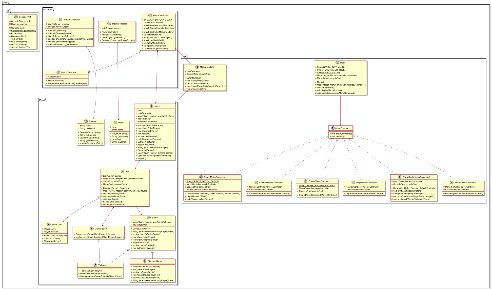

## IWVG: Trabajo práctico: DOO

# Proyecto de Tenis

En el presente proyecto se aplica todo lo aprendido en clase.

### Autores
Alvaro Fernando Chavez Chavez 

Martxel Aranzadi Olazabal

## Diagrama de Dominio

## Diagrama de Paquetes

## Diagrama de clases

## Auto evaluación

Hemos implementado varias cosas dadas en clase como la abstracción y la herencia además de la división de métodos y clases
utilizando lo aprendido en clase.